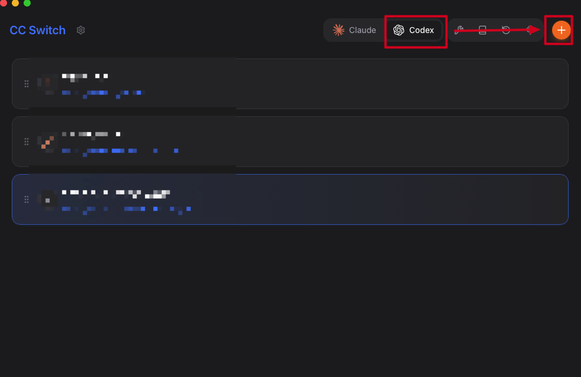

# Codex 配置教程

## 前置条件

1. **开启科学上网**
2. **安装最新版 cc-switch**

   ```bash
   # 首次安装
   brew tap farion1231/ccswitch
   brew install --cask cc-switch

   # 升级
   brew upgrade --cask cc-switch
   ```

---

## 配置步骤

**1. 安装 Codex 插件**

打开 VSCode，在扩展程序面板中搜索并安装 **Codex** 插件。


**2. 在 cc-switch 中添加配置**

打开 cc-switch，选择 Codex，然后点击「添加配置」按钮。



**3. 填写 API 配置**

依次填写以下信息：
- `base_url`：API 服务地址
- `API_KEY`：对应服务的密钥
- 模型名称：根据实际使用的模型填写

**4. 选择配置好的 API 服务**

在 cc-switch 中切换到刚才配置的 API 服务。

**5. 重启 VSCode**

> **注意：** 每次在 cc-switch 中切换 API 服务后，必须重启 VSCode，配置才会生效。
