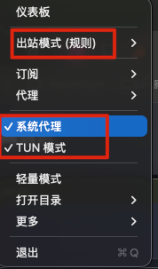
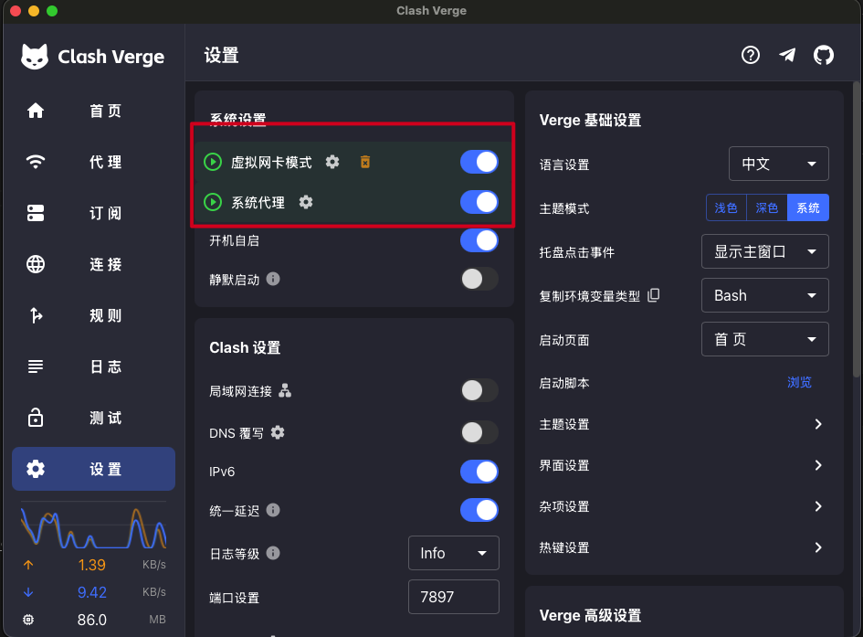
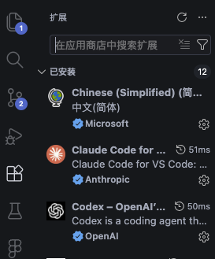

# Vibe Coding 使用指南

> 📌 **重要提示**：国内用户需要配置代理访问

---

## 目录

- [Vibe Coding 使用指南](#vibe-coding-使用指南)
  - [目录](#目录)
  - [网络环境配置](#网络环境配置)
  - [安装 Homebrew](#安装-homebrew)
  - [安装 cc-switch](#安装-cc-switch)
  - [安装 VSCode](#安装-vscode)
  - [安装 VSCode 插件](#安装-vscode-插件)
  - [更多资源](#更多资源)

---

## 网络环境配置

- 确保代理正常运行
- 启用代理的 **TUN 模式**（推荐）

| 代理配置 | TUN 模式 |
|:--------:|:--------:|
|  |  |

---

## 安装 Homebrew

访问 [brew.sh](https://brew.sh/) 获取最新安装命令。

---

## 安装 cc-switch

> 🔄 **模型切换工具** - 快速切换 Claude Code 使用的模型

**开源地址**：https://github.com/farion1231/cc-switch/releases

```bash
# 添加 Tap 源
brew tap farion1231/ccswitch

# 安装
brew install --cask cc-switch

# 更新到最新版本
brew upgrade --cask cc-switch
```

---

## 安装 VSCode

**下载地址**：https://code.visualstudio.com/docs/setup/mac

---

## 安装 VSCode 插件

1. 打开 VSCode
2. 按 `Cmd + Shift + X` 打开扩展面板
3. 搜索并安装以下插件：

| 插件名称 | 说明 |
|---------|------|
| **Claude Code for VS Code** | Claude 官方插件 |
| **Codex** | OpenAI Codex 插件 |

**可选**：安装中文语言包（搜索 "Chinese (Simplified)"）



---

## 更多资源

*待补充...*

---

**祝你使用愉快！🎉**
